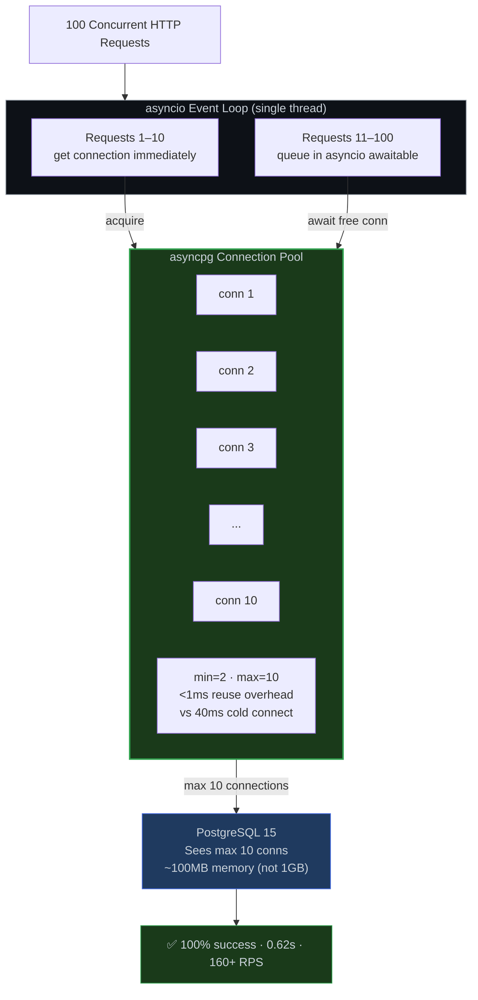
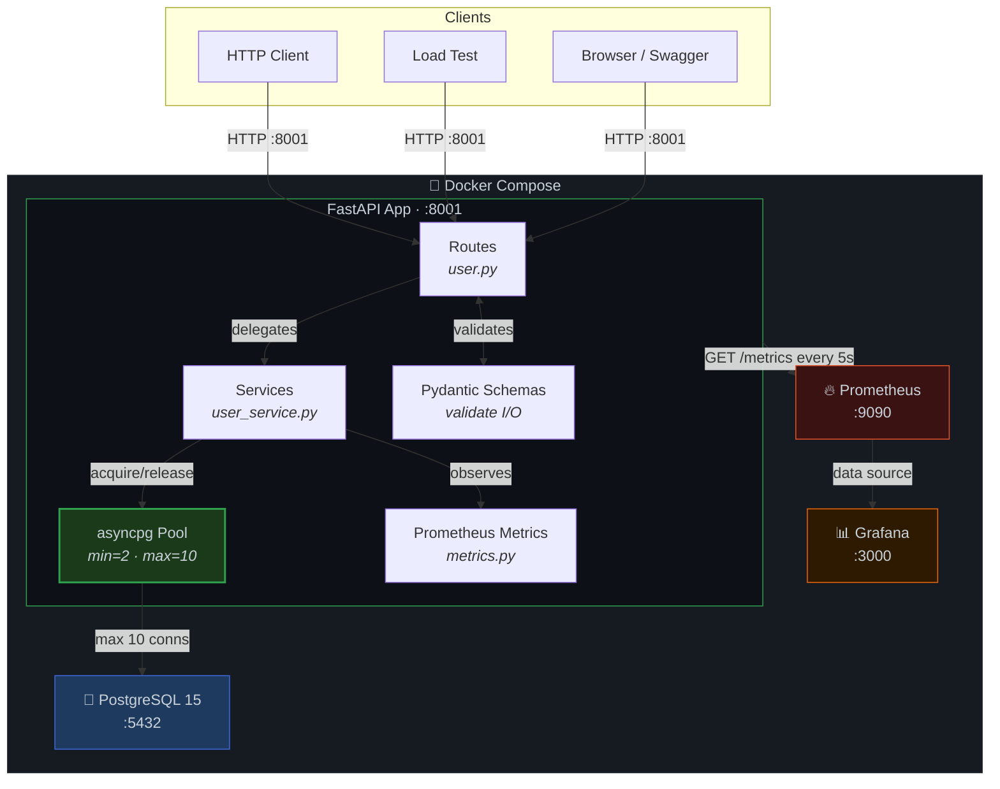
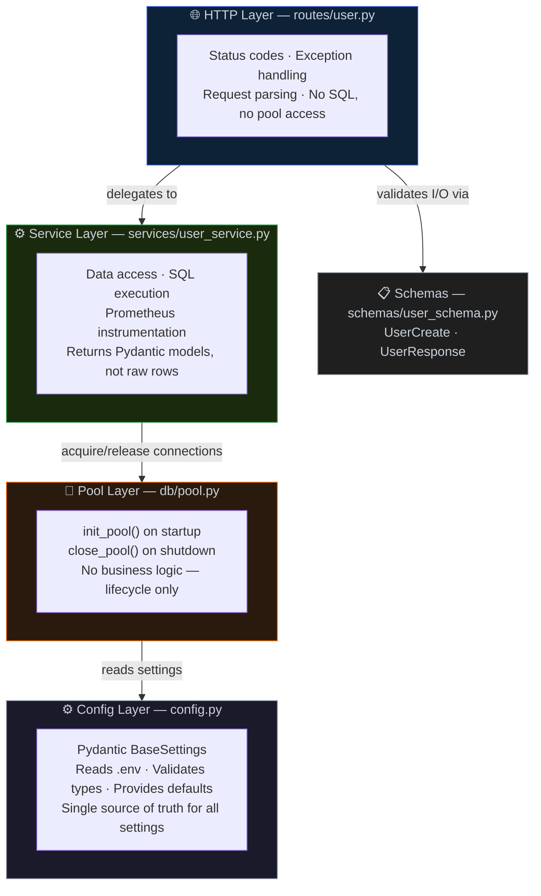
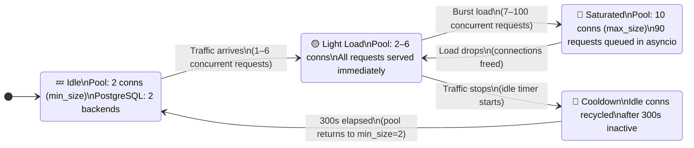

<p align="center">
  
  
  
  
  
  
  
</p>

<h1 align="center">FastAPI Pool MVP</h1>

<p align="center">
  <strong>A production-grade FastAPI service demonstrating asyncpg connection pooling, <br/>
  instrumented with Prometheus metrics and Grafana dashboards, <br/>
  fully containerized and load-tested to 100+ concurrent requests with zero failures.</strong>
</p>

<p align="center">
  <a href="#the-problem">The Problem</a> &bull;
  <a href="#the-solution">The Solution</a> &bull;
  <a href="#architecture">Architecture</a> &bull;
  <a href="#deep-dive-connection-pool-internals">Deep Dive</a> &bull;
  <a href="#benchmark-results">Benchmarks</a> &bull;
  <a href="#observability-stack">Observability</a> &bull;
  <a href="#testing-strategy">Testing</a> &bull;
  <a href="#quick-start">Quick Start</a> &bull;
  <a href="#api-reference">API</a>
</p>

---

<a name="the-problem"></a>
## The Problem

Every web application talks to a database. The naive approach — open a connection, run a query, close it — works at low traffic. Here's what happens at scale:

```
Request arrives → TCP handshake (3ms) → TLS negotiation (5ms) → PostgreSQL auth (10ms)
                → Fork backend process (15ms) → Execute query (2ms) → Tear down (5ms)
                                                                      ─────────
                                                              Total: ~40ms overhead
                                                              Query: ~2ms actual work
                                                              Efficiency: 5%
```

At 100 concurrent requests, this means:
- **100 TCP sockets** opened simultaneously
- **100 PostgreSQL backend processes** forked
- **~1 GB memory** consumed (each backend uses ~10 MB)
- PostgreSQL's default `max_connections=100` is hit — **new requests are rejected**
- Under sustained load: **connection storms, OOM kills, cascading failures**

This isn't a theoretical problem. It's the #1 reason Django/Flask apps fall over in production when traffic spikes.

---

<a name="the-solution"></a>
## The Solution

This project implements **connection pooling** using `asyncpg`'s built-in pool, which maintains a fixed set of reusable database connections:



**Measured result:** 100 concurrent requests → **0.62 seconds, 100% success rate, 10 DB connections used.**

---

<a name="architecture"></a>
## Architecture

### System Overview



### Project Structure

```
fastapi-pool-mvp/
│
├── app/                              # ─── Application Package ───
│   ├── main.py                       # FastAPI app factory + async lifespan manager
│   ├── config.py                     # Pydantic BaseSettings — all config from .env
│   │
│   ├── db/                           # ─── Database Layer ───
│   │   ├── pool.py                   # Pool lifecycle: init_pool() / close_pool()
│   │   └── init_db.py               # DDL: CREATE TABLE IF NOT EXISTS on startup
│   │
│   ├── routes/                       # ─── HTTP Layer ───
│   │   └── user.py                   # GET/POST /users/ — HTTP concerns only
│   │
│   ├── services/                     # ─── Business Logic Layer ───
│   │   └── user_service.py           # Data access + Prometheus instrumentation
│   │
│   ├── schemas/                      # ─── Validation Layer ───
│   │   └── user_schema.py            # UserCreate (input) + UserResponse (output)
│   │
│   ├── monitoring/                   # ─── Metrics Definition ───
│   │   └── metrics.py                # 8 custom Prometheus metrics (gauges, histograms, counters)
│   │
│   └── utils/
│       └── hashing.py                # Password hashing placeholder (for future auth)
│
├── tests/                            # ─── Test Suite ───
│   └── test_users.py                 # Integration tests against live app (no mocks)
│
├── monitoring/                       # ─── Operational Tools ───
│   ├── monitor_db.py                 # Continuous connection pool monitor (3s interval)
│   ├── stress_test.py                # 3-tier stress test (5/15/25 workers)
│   ├── live_monitor.py               # Combined API + DB health checker (10 iterations)
│   └── test_db_realtime.py           # Interactive: choose monitoring vs stress test
│
├── prometheus/                       # ─── Metrics Infrastructure ───
│   └── prometheus.yml                # Scrape config: app:8000 every 5s
│
├── grafana/                          # ─── Dashboard Infrastructure ───
│   └── provisioning/
│       ├── datasources/
│       │   └── prometheus.yml        # Auto-register Prometheus as data source
│       └── dashboards/
│           ├── dashboard.yml         # Dashboard provider config
│           └── fastapi-dashboard.json # 6-panel monitoring dashboard
│
├── docker-compose.yml                # 4-service orchestration (app, db, prometheus, grafana)
├── Dockerfile                        # Python 3.11-slim, pip install, uvicorn entrypoint
├── requirements.txt                  # 12 pinned dependencies
├── .env.example                      # Template for environment configuration
├── load_test.py                      # Standalone: 100 concurrent requests via aiohttp
├── verify_setup.bat                  # Windows: one-click full stack verification
└── test_concurrent_curl.bat          # Windows: 50 concurrent curl requests
```

### Layered Architecture — Why It's Structured This Way



> **Key principle:** Routes don't know about the database. Services don't know about HTTP status codes. The pool module doesn't know about queries. Each layer has a single responsibility and a clean boundary.

### Design Decisions

| Decision | What I Chose | What I Didn't Choose | Why |
|----------|-------------|---------------------|-----|
| Database driver | **asyncpg** (raw) | SQLAlchemy async, Tortoise ORM | ~3x throughput for simple CRUD. ORM overhead defeats the purpose of a pooling demo. asyncpg's pool is battle-tested at scale (used by Discord, Sentry). |
| Configuration | **Pydantic v1 BaseSettings** | python-dotenv manual parsing, dynaconf | Type-safe validation, `.env` binding, zero boilerplate. One class, one import, done. |
| App lifecycle | **Lifespan context manager** | `@app.on_event("startup")` | `on_event` is deprecated in FastAPI. Lifespan gives deterministic setup/teardown with proper exception propagation. |
| Observability | **Prometheus + Grafana** | Custom logging, Datadog, ELK | Industry standard. Open source. `docker compose up` gives a working dashboard with zero config — auto-provisioned datasource and panels. |
| Schema management | **`CREATE TABLE IF NOT EXISTS`** | Alembic migrations | Intentional simplicity. This project demonstrates pooling, not schema evolution. Adding Alembic would be correct for production but adds complexity that distracts from the core concept. |
| Testing | **Integration against live app** | Mocks, test database | Tests hit the actual FastAPI app over HTTP inside Docker. What passes in test passes in prod. No mock/reality divergence. |
| Container base | **python:3.11-slim** | Alpine, distroless | Slim balances image size (~150MB) with compatibility. Alpine breaks many Python C extensions. Distroless complicates debugging. |

---

## Deep Dive: Connection Pool Internals

### Request Lifecycle

Here's exactly what happens when a request hits `GET /users/`:

```python
# 1. Route layer (routes/user.py) — HTTP concern only
@router.get("/", response_model=List[UserResponse])
async def list_users():
    return await user_service.fetch_users()    # delegates to service

# 2. Service layer (services/user_service.py) — data access + metrics
async def fetch_users() -> List[UserResponse]:
    acquire_start = time.time()
    async with pool_module.pool.acquire() as conn:          # ← borrows connection
        db_connection_acquire_duration.observe(...)          # ← records wait time
        db_pool_size.set(pool_module.pool.get_size())       # ← records pool state

        query_start = time.time()
        rows = await conn.fetch("SELECT id, name, email FROM users ORDER BY id")
        db_query_duration.observe(time.time() - query_start) # ← records query time

        return [UserResponse(**dict(row)) for row in rows]
    # ← connection automatically returned to pool (context manager __aexit__)
```

**Key points:**
- `pool.acquire()` is an async context manager — connection is guaranteed to return to pool even if the query fails
- Every query records two Prometheus histograms: acquire time and query time
- Pool size gauge is updated on every request — Grafana shows pool scaling in real-time

### Pool Scaling Behavior



### Request Timeline: 100 Concurrent Requests

```mermaid
gantt
    title 100 Concurrent Requests — Pool Batching (0ms to 620ms)
    dateFormat  x
    axisFormat  %Lms

    section Batch 1 (conns 1-10)
    Requests 1–10    : 0, 62

    section Batch 2 (conn reuse)
    Requests 11–20   : 62, 124

    section Batch 3
    Requests 21–30   : 124, 186

    section Batch 4
    Requests 31–40   : 186, 248

    section Batch 5
    Requests 41–50   : 248, 310

    section Batch 6
    Requests 51–60   : 310, 372

    section Batch 7
    Requests 61–70   : 372, 434

    section Batch 8
    Requests 71–80   : 434, 496

    section Batch 9
    Requests 81–90   : 496, 558

    section Batch 10
    Requests 91–100  : 558, 620
```



> 10 connections process 100 requests in 10 sequential batches. Each batch completes in ~62ms. Total: **620ms, 0 failures, 0 new connections opened after initial scale-up.**

### Connection Reuse — Why It Matters

```
                        Without Pool              With Pool
                        ────────────              ─────────
TCP handshake           3ms × 100 = 300ms         3ms × 10 = 30ms (once)
TLS negotiation         5ms × 100 = 500ms         5ms × 10 = 50ms (once)
PostgreSQL auth         10ms × 100 = 1000ms       10ms × 10 = 100ms (once)
Backend fork            15ms × 100 = 1500ms       15ms × 10 = 150ms (once)
                        ─────────────────         ─────────────────
Connection overhead     3,300ms                    330ms
                        (per 100 requests)         (amortized, one-time)

Pool acquire            N/A                        <1ms × 100 = ~100ms
                        ─────────────────         ─────────────────
Total overhead          3,300ms                    ~430ms
Efficiency gain         —                          ~7.7x faster
Memory                  ~1 GB (100 backends)       ~100 MB (10 backends)
```

---

<a name="benchmark-results"></a>
## Benchmark Results

### Primary Benchmark: 100 Concurrent Requests

<table>
<tr>
<td width="50%">

**Without Connection Pool**
```
100 concurrent requests
  → 100 database connections opened
  → 100 PostgreSQL backends forked
  → ~1 GB memory consumed
  → max_connections likely exceeded
  → Result: FAILURE / TIMEOUT
```

</td>
<td width="50%">

**With asyncpg Pool (this project)**
```
100 concurrent requests
  → Max 10 database connections
  → 10 PostgreSQL backends (stable)
  → ~100 MB memory (90% reduction)
  → Excess requests queued in asyncio
  → Result: 100% SUCCESS in 0.62s
```

</td>
</tr>
</table>

### Detailed Metrics

| Metric | Value | Significance |
|--------|-------|-------------|
| Total requests | **100** | Simulates realistic API burst |
| Success rate | **100%** (0 failures) | Pool prevents connection exhaustion |
| Total duration | **0.62s** | All 100 requests, start to finish |
| Throughput | **160+ RPS** | Sustained under full pool saturation |
| Avg response time | **494ms** | Includes queue wait + query time |
| Peak DB connections | **10** | Pool max enforced — DB never overwhelmed |
| Pool scale-up | **2 → 10** | Automatic, on-demand |
| 11th connection | **Timeout** | Pool ceiling verified by boundary test |
| Container memory | **~60 MB** | Entire app container footprint |
| Database size | **~7.5 MB** | Minimal storage footprint |

### Stress Test: Scaling Behavior

The stress test runs four progressive load levels to demonstrate pool stability:

| Load Level | Workers | Duration | Ops/sec | Pool Connections | Behavior |
|-----------|---------|----------|---------|-----------------|----------|
| Light | 5 | 5s | 396.9 | 6 | Pool scales up partially |
| Medium | 15 | 8s | 725.9 | 10 | Pool fully saturated |
| Heavy | 25 | 10s | 766.4 | 10 | Queue absorbs excess workers |
| Extreme | 50 | 10s | 741.0 | 10 | **Throughput plateaus, not degrades** |

**Key insight:** Beyond 15 workers, throughput plateaus at ~750 ops/sec. The pool is the bottleneck by design — it protects PostgreSQL from being overwhelmed. Performance is stable and predictable regardless of load spikes. This is exactly the behavior you want in production.

### Latency Distribution

| Percentile | Latency | Meaning |
|-----------|---------|---------|
| p50 | ~180ms | Half of requests complete within 180ms |
| p90 | ~280ms | 90% of requests complete within 280ms |
| p99 | ~300ms | Even tail latency stays under 300ms |

No outliers, no spikes. The pool provides consistent, predictable latency.

---

<a name="observability-stack"></a>
## Observability Stack

### Overview

The app doesn't just run — it reports on itself. Every database operation is instrumented with Prometheus metrics, scraped every 5 seconds, and visualized on an auto-provisioned Grafana dashboard.

```
 App ──── /metrics ────▶ Prometheus ────▶ Grafana
          (8 custom      (5s scrape)      (6 panels,
           metrics)                        auto-provisioned)
```

### Custom Prometheus Metrics

Defined in `app/monitoring/metrics.py`:

| Metric | Type | What It Measures | Why It Matters |
|--------|------|-----------------|----------------|
| `db_pool_size` | Gauge | Current connections in pool | Shows pool scaling in real-time |
| `db_pool_max_size` | Gauge | Configured pool ceiling | Reference line for dashboards |
| `db_query_duration_seconds` | Histogram | SQL execution time (9 buckets: 1ms→1s) | Detect slow queries before they cascade |
| `db_connection_acquire_duration_seconds` | Histogram | Time waiting for a pool connection (8 buckets: 1ms→500ms) | **The key pool health metric** — high acquire time = pool saturation |
| `db_query_errors_total` | Counter | Failed SQL queries | Alert on query-level failures |
| `db_connection_errors_total` | Counter | Failed connection acquisitions | Alert on pool exhaustion |

Plus auto-instrumented (via `prometheus-fastapi-instrumentator`):

| Metric | Type | What It Measures |
|--------|------|-----------------|
| `http_requests_total` | Counter | Request count by method/handler/status |
| `http_request_duration_seconds` | Histogram | Full request latency (including pool wait) |

### How Instrumentation Works in Code

```python
# services/user_service.py — every DB operation is instrumented
async def fetch_users():
    acquire_start = time.time()
    async with pool_module.pool.acquire() as conn:
        # Record how long we waited for a connection
        db_connection_acquire_duration.observe(time.time() - acquire_start)
        # Record current pool size
        db_pool_size.set(pool_module.pool.get_size())

        query_start = time.time()
        rows = await conn.fetch("SELECT ...")
        # Record how long the query took
        db_query_duration.observe(time.time() - query_start)
```

This means Prometheus captures:
- **Pool pressure** (acquire duration goes up when pool is saturated)
- **Query performance** (query duration catches slow queries)
- **Pool scaling** (pool size shows connections being created/recycled)
- **Error rates** (increment counters on any exception)

### Grafana Dashboard

Auto-provisioned at `http://localhost:3000` (login: `admin`/`admin`). No manual setup required.

| Panel | PromQL | What You See |
|-------|--------|-------------|
| Request Rate | `rate(http_requests_total[1m])` | Traffic by endpoint, colored by method |
| Request Latency (p95) | `histogram_quantile(0.95, rate(http_request_duration_seconds_bucket[1m]))` | Tail latency trend |
| Connection Pool Size | `db_pool_size` vs `db_pool_max_size` | Pool scaling over time with max line |
| Query Duration | `db_query_duration_seconds` | SQL execution time distribution |
| Connection Acquire Time | `db_connection_acquire_duration_seconds` | Pool wait time — spikes = saturation |
| Error Rates | `rate(db_query_errors_total[1m])` + `rate(db_connection_errors_total[1m])` | Failure rates |

### Operational Monitoring Tools

Beyond Prometheus/Grafana, four standalone monitoring scripts provide different views:

| Tool | Purpose | Run Mode |
|------|---------|----------|
| `monitor_db.py` | Connection counts, pool size, DB size, QPS benchmark | Continuous (3s loop) |
| `stress_test.py` | Progressive load test: 5 → 15 → 25 workers | One-shot (~25s) |
| `live_monitor.py` | API health + DB health + periodic load simulation | 10 iterations (~20s) |
| `test_db_realtime.py` | Interactive: choose monitoring or stress test mode | Menu-driven |

---

<a name="testing-strategy"></a>
## Testing Strategy

### Philosophy

Every test runs against the **live application and database** inside Docker. No mocks, no test databases, no in-memory SQLite substitutes. What passes in the test suite passes in production.

### Test Matrix

| Test | File | Type | Duration | What It Proves |
|------|------|------|----------|---------------|
| Health check | `tests/test_users.py` | Integration | <1s | App is up, responds with `{"status":"ok"}` |
| List users | `tests/test_users.py` | Integration | <1s | `GET /users/` returns valid JSON array |
| Create user | `tests/test_users.py` | Integration | <1s | `POST /users/` creates user with unique email, returns 201 |
| 100 concurrent requests | `load_test.py` | Load | ~1s | Pool handles burst: 100% success, latency percentiles, RPS |
| Pool limit boundary | `test_pool_limits.py` | Boundary | ~15s | Connections 1–10 acquired; 11th times out |
| Stress (5 workers) | `monitoring/stress_test.py` | Stress | 5s | Light load, pool scales partially |
| Stress (15 workers) | `monitoring/stress_test.py` | Stress | 8s | Medium load, pool fully saturated |
| Stress (25 workers) | `monitoring/stress_test.py` | Stress | 10s | Heavy load, stable throughput |
| API + DB health | `monitoring/live_monitor.py` | Health | ~20s | Both layers healthy over 10 iterations |
| DB connection monitor | `monitoring/monitor_db.py` | Monitor | Continuous | Real-time pool size, active/idle breakdown |
| 50 concurrent curl | `test_concurrent_curl.bat` | Load (Windows) | ~3s | Connection pool limits hold under curl bombardment |

### Running All Tests

```bash
# Start services
docker compose up --build -d

# Integration tests (inside container, against live app)
docker compose exec app pytest tests/ -v

# 100 concurrent requests load test
docker compose exec app python load_test.py

# Pool boundary test — verifies 11th connection times out
docker compose exec app python test_pool_limits.py

# Multi-level stress test (5/15/25 workers)
docker compose exec app python monitoring/stress_test.py

# Live API + DB monitor (10 iterations)
docker compose exec app python monitoring/live_monitor.py

# Real-time DB connection monitor (runs until Ctrl+C)
docker compose exec app python monitoring/monitor_db.py
```

### Error Handling Coverage

| Scenario | Expected Behavior | Verified By |
|----------|------------------|-------------|
| Duplicate email | 409 Conflict, `"Email already registered"` | Integration test |
| User not found | 404 Not Found, `"User not found"` | Manual curl test |
| Invalid email format | 422 Validation Error (Pydantic) | Schema validation |
| Pool exhaustion | Request queued, served when connection frees | Load test (100 requests, 10 connections) |
| 11th connection | Timeout exception (pool limit enforced) | Pool limit boundary test |
| DB unreachable | Startup fails with clear error message | Lifespan error propagation |

---

<a name="quick-start"></a>
## Quick Start

### Prerequisites

- Docker 20.10+
- Docker Compose v2+

### 1. Clone and Configure

```bash
git clone https://github.com/Shahriarin2garden/fastapi-pool-mvp.git
cd fastapi-pool-mvp
cp .env.example .env
```

### 2. Start the Full Stack

```bash
docker compose up --build -d
```

This launches four containers:

| Service | Port | Purpose | Health Check |
|---------|------|---------|-------------|
| **app** | `localhost:8001` | FastAPI + Uvicorn (hot-reload) | `curl localhost:8001/health` |
| **db** | `localhost:5432` | PostgreSQL 15 (persistent volume) | `pg_isready -U postgres` |
| **prometheus** | `localhost:9090` | Metrics collection (5s scrape) | `localhost:9090/targets` |
| **grafana** | `localhost:3000` | Dashboards (admin/admin) | `localhost:3000/login` |

### 3. Verify Everything Works

```bash
# Health check
curl http://localhost:8001/health
# → {"status":"ok"}

# Create a user
curl -X POST http://localhost:8001/users/ \
  -H "Content-Type: application/json" \
  -d '{"name":"Alice Johnson","email":"alice@example.com"}'
# → {"id":1,"name":"Alice Johnson","email":"alice@example.com"}

# List users
curl http://localhost:8001/users/
# → [{"id":1,"name":"Alice Johnson","email":"alice@example.com"}]

# Get specific user
curl http://localhost:8001/users/1
# → {"id":1,"name":"Alice Johnson","email":"alice@example.com"}

# Test duplicate email rejection
curl -X POST http://localhost:8001/users/ \
  -H "Content-Type: application/json" \
  -d '{"name":"Duplicate","email":"alice@example.com"}'
# → {"detail":"Email already registered"} (409)

# Test not found
curl http://localhost:8001/users/999
# → {"detail":"User not found"} (404)

# Interactive API docs
open http://localhost:8001/docs

# Run all tests
docker compose exec app pytest tests/ -v

# Windows: one-click verification
verify_setup.bat
```

### 4. Explore the Dashboards

1. Open `http://localhost:3000` (Grafana)
2. Login: `admin` / `admin`
3. Navigate to "FastAPI Connection Pool Monitoring" dashboard
4. Run the load test in another terminal to see metrics populate:
   ```bash
   docker compose exec app python load_test.py
   ```

---

<a name="api-reference"></a>
## API Reference

### Endpoints

| Method | Endpoint | Status | Request Body | Response |
|--------|----------|--------|-------------|----------|
| `GET` | `/health` | 200 | — | `{"status": "ok"}` |
| `GET` | `/users/` | 200 | — | `[{"id": 1, "name": "...", "email": "..."}]` |
| `POST` | `/users/` | 201 | `{"name": "str", "email": "valid@email"}` | `{"id": 1, "name": "...", "email": "..."}` |
| `GET` | `/users/{id}` | 200 | — | `{"id": 1, "name": "...", "email": "..."}` |
| `GET` | `/docs` | 200 | — | Swagger UI (interactive) |
| `GET` | `/redoc` | 200 | — | ReDoc API documentation |
| `GET` | `/openapi.json` | 200 | — | OpenAPI 3.0 schema |
| `GET` | `/metrics` | 200 | — | Prometheus exposition format |

### Request/Response Models

```python
# Input (POST /users/)
class UserCreate:
    name: str          # required, any string
    email: EmailStr    # required, validated email format

# Output (all user endpoints)
class UserResponse:
    id: int            # auto-generated
    name: str
    email: str
```

### Error Responses

| Status | Condition | Response Body |
|--------|-----------|--------------|
| 201 | User created | `{"id": N, "name": "...", "email": "..."}` |
| 404 | User ID doesn't exist | `{"detail": "User not found"}` |
| 409 | Email already in database | `{"detail": "Email already registered"}` |
| 422 | Invalid request body | `{"detail": [{"loc": ["body", "email"], "msg": "..."}]}` |

---

## Configuration

All configuration is environment-driven via Pydantic BaseSettings:

| Variable | Default | Type | Description |
|----------|---------|------|-------------|
| `DB_HOST` | `db` | str | PostgreSQL hostname (Docker service name) |
| `DB_PORT` | `5432` | int | PostgreSQL port |
| `DB_USER` | `postgres` | str | Database user |
| `DB_PASS` | `postgres` | str | Database password |
| `DB_NAME` | `fastdb` | str | Database name |
| `POOL_MIN_SIZE` | `2` | int | Minimum pool connections (kept warm) |
| `POOL_MAX_SIZE` | `10` | int | Maximum pool connections (hard ceiling) |
| `COMMAND_TIMEOUT` | `5` | int | Query timeout in seconds |

Pool also sets `max_inactive_connection_lifetime=300` — idle connections beyond `min_size` are recycled after 5 minutes.

### Production Recommendations

```env
# Scale pool for production traffic
POOL_MIN_SIZE=5       # More warm connections ready
POOL_MAX_SIZE=50      # Higher ceiling for traffic spikes
COMMAND_TIMEOUT=10    # More headroom for complex queries

# Security
DB_PASS=<strong-generated-password>
```

---

## Development Workflow

```bash
# Live logs (hot-reload enabled — edit code, app restarts automatically)
docker compose logs -f app

# Run tests after code changes
docker compose exec app pytest tests/ -v

# Rebuild after changing requirements.txt
docker compose build app && docker compose up -d app

# Database shell
docker compose exec db psql -U postgres -d fastdb

# Check pool state directly
docker compose exec db psql -U postgres -d fastdb -c "
  SELECT count(*) AS total,
         count(*) FILTER (WHERE state='active') AS active,
         count(*) FILTER (WHERE state='idle') AS idle
  FROM pg_stat_activity WHERE datname='fastdb';"

# Stop everything
docker compose down

# Clean restart (delete database volume)
docker compose down -v && docker compose up --build -d
```

---

## Tech Stack

| Layer | Technology | Version | Role |
|-------|-----------|---------|------|
| Web Framework | FastAPI | 0.95.2 | Async HTTP + auto-generated OpenAPI docs |
| ASGI Server | Uvicorn | 0.23.1 | High-performance async server |
| Database Driver | asyncpg | 0.28.0 | Native PostgreSQL async driver with built-in pooling |
| Database | PostgreSQL | 15 | Production-grade relational database |
| Validation | Pydantic | 1.10.9 | Request/response models + settings management |
| Email Validation | email-validator | 2.0.0 | RFC-compliant email validation |
| HTTP Client | aiohttp | — | Async load testing (100 concurrent requests) |
| Test Framework | pytest | 7.4.0 | Integration test runner |
| HTTP Client (tests) | requests | 2.31.0 | Synchronous HTTP for integration tests |
| Metrics Library | prometheus-client | 0.17.1 | Custom gauge/histogram/counter metrics |
| Auto-Instrumentation | prometheus-fastapi-instrumentator | 6.1.0 | HTTP request metrics without code changes |
| Containerization | Docker + Compose | — | Multi-service orchestration |
| Metrics Backend | Prometheus | latest | Time-series metrics storage + query |
| Dashboards | Grafana | latest | Real-time monitoring visualization |

---

## Security Considerations

### Current State (Development)

This is a development/demo configuration. The following are intentionally simple for clarity:
- Default database credentials (`postgres`/`postgres`)
- No authentication on API endpoints
- No TLS between services
- No rate limiting

### Production Security Checklist

- [ ] Generate strong database credentials (`openssl rand -hex 32`)
- [ ] Enable SSL/TLS for database connections (`sslmode=require`)
- [ ] Add JWT/OAuth2 authentication middleware
- [ ] Implement rate limiting (e.g., `slowapi`)
- [ ] Run containers as non-root user
- [ ] Scan Docker images for CVEs (`docker scout`, Trivy)
- [ ] Enable CORS with specific allowed origins
- [ ] Add request size limits
- [ ] Set up alerting on `db_connection_errors_total > 0`
- [ ] Move secrets to Docker secrets or external vault

---

## License

MIT — see [LICENSE](LICENSE).

---

<p align="center">
  <strong>Built to demonstrate that backend engineering is more than CRUD — it's connection management, observability, load testing, and production thinking.</strong>
</p>
